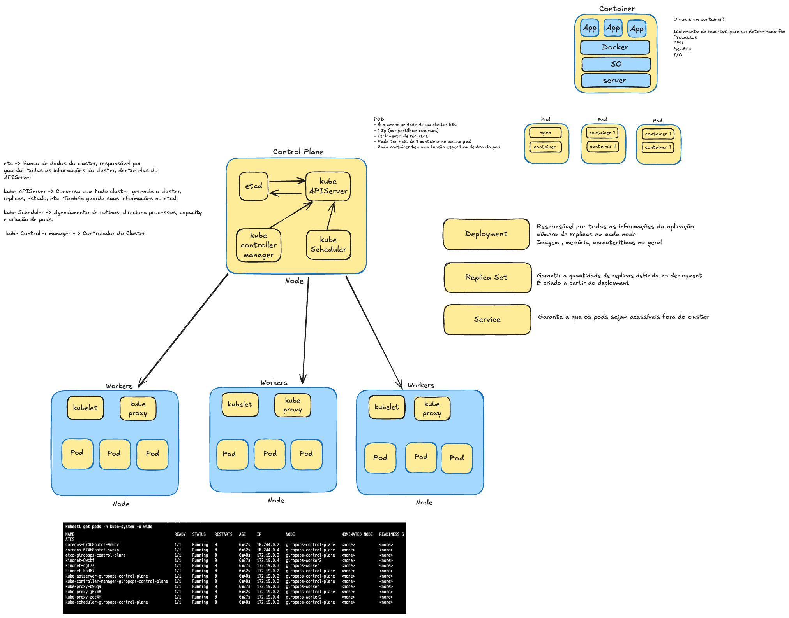

# 🚀 Descomplicando Kubernetes

Este projeto tem como objetivo documentar e compartilhar o conhecimento adquirido durante os estudos sobre o Kubernetes, organizado em dias de aprendizado progressivo.

## 📚 Referências

- [Treinamento LinuxTips PICK](https://www.linuxtips.io/pick)
- [Documentação oficial Kubernetes](https://kubernetes.io/docs/home/)

## 🎯 Objetivo

Para termos maior compreensão do Kubernetes, precisamos entender alguns componentes que são essenciais para seu funcionamento. Esta documentação está organizada em dias de estudo, cada um focando em conceitos específicos e práticos.

## 🔧 Fundamentos do Kubernetes

### O que é um Container Engine?

Um container engine é um serviço responsável por criar containers. Alguns dos exemplos mais conhecidos são o Docker e o Podman. Ele fornece a funcionalidade básica de empacotamento de aplicações e suas dependências em containers portáteis e leves.

### O que é um Container Runtime?

Um container runtime é um serviço responsável por executar os containers. Ele interage com o Kernel do sistema operacional e envia as informações para o containerd, que é um daemon que gerencia o ciclo de vida dos containers. Exemplos de runtimes incluem `runc` e `CRI-O`.

### O que é OCI?

Open Container Initiative (OCI) é uma organização fundada por diversas empresas do setor de tecnologia com o objetivo de padronizar a criação de containers. O principal objetivo da OCI é garantir a compatibilidade entre diferentes container engines e runtimes, estabelecendo padrões abertos para a criação, execução e especificação de containers.

#### Componentes Principais da OCI

1. **OCI Runtime Specification**: Define como os runtimes de containers devem comportar-se ao executar um container.
2. **OCI Image Specification**: Define o formato das imagens de containers, facilitando a criação e o compartilhamento de imagens de containers entre diferentes plataformas e ferramentas.

### Relação entre Container Engine, Runtime e OCI no Kubernetes

No Kubernetes, o container engine e o container runtime desempenham papéis cruciais para a orquestração de containers:

- **Container Engine**: Utilizado para criar e gerenciar as imagens dos containers.
- **Container Runtime**: Utilizado para executar e gerenciar o ciclo de vida dos containers em execução nos nós do cluster.
- **OCI**: Garante que as imagens de containers e os runtimes sejam compatíveis, permitindo que Kubernetes funcione de maneira eficiente com diferentes tecnologias de container.

## 🏗️ Arquitetura do Kubernetes

### 📊 Diagrama da Arquitetura

Para uma compreensão visual da arquitetura do Kubernetes, consulte o diagrama abaixo que ilustra os componentes principais e suas interações:

*Figura 1: Visão geral da arquitetura do Kubernetes e seus componentes principais*

### Kubernetes Control Plane

O Control Plane no Kubernetes é responsável por controlar e gerenciar o cluster. Ele coordena todas as atividades dentro do cluster e se comunica diretamente com os nós (workers) para garantir que os aplicativos estejam funcionando conforme esperado.

#### Componentes do Control Plane

##### etcd

- **Descrição**: O etcd é o banco de dados chave-valor altamente disponível que armazena todos os dados de configuração do cluster, incluindo a informação do estado do cluster.
- **Função**: Guarda todas as informações referentes ao cluster e as informações do kube-api-server.

##### kube-apiserver

- **Descrição**: O kube-apiserver é o componente que expõe a API Kubernetes. É o ponto de entrada para todas as operações administrativas do cluster.
- **Função**: Gerencia todos os recursos do cluster (como Pods, ReplicaSets, etc.) e armazena essas informações no etcd.

##### kube-scheduler

- **Descrição**: O kube-scheduler é responsável por atribuir Pods não atribuídos a nós específicos.
- **Função**: Agendamento de pods, garantindo que eles sejam implantados em nós com capacidade suficiente e conforme as políticas de afinidade/anti-afinidade.

##### kube-controller-manager

- **Descrição**: O kube-controller-manager é um daemon que embala e executa os controladores principais do Kubernetes em um único processo.
- **Função**: Gerencia os controladores do cluster, como o controller de replicação, controller de endpoints, controller de namespace, e outros. Ele garante que o estado desejado do cluster seja mantido.

### Kubernetes Workers

No Kubernetes, os **workers** são responsáveis por executar as aplicações dentro dos pods. Cada worker node é um servidor físico ou virtual que roda os componentes necessários para manter os pods em execução e se comunicar com o Control Plane.

#### Componentes dos Workers

##### kubelet

- **Descrição**: O kubelet é o agente do Kubernetes que roda em todos os nós do cluster.
- **Função**: O kubelet garante que os containers descritos nos objetos de Pod estejam rodando corretamente. Ele monitora o estado dos pods e reporta ao Control Plane.

##### kube-proxy

- **Descrição**: O kube-proxy é um componente de rede que roda em cada nó do cluster.
- **Função**: Ele mantém as regras de rede nos nós, permitindo a comunicação de rede entre pods e a comunicação entre pods e serviços externos ao cluster. O kube-proxy gerencia as regras de iptables ou ipvs e facilita a conectividade de rede para os serviços do Kubernetes.

## 🔌 Portas Utilizadas no Kubernetes

Aqui está uma lista das portas comuns utilizadas no Kubernetes e suas respectivas funções:

### Control Plane

#### etcd
- **Porta 2379-2380**: Utilizada para comunicação cliente-servidor e comunicação entre os nós do etcd.

#### kube-apiserver
- **Porta 6443**: Porta padrão para a API do Kubernetes. É utilizada para todas as comunicações dentro do cluster com o kube-apiserver.

#### kube-scheduler
- **Porta 10251**: Porta para a comunicação interna com o kube-scheduler.
- **Porta 10259**: Porta para comunicação de métricas no kube-scheduler (desde Kubernetes 1.20).

#### kube-controller-manager
- **Porta 10252**: Porta para a comunicação interna com o kube-controller-manager.
- **Porta 10257**: Porta para comunicação de métricas no kube-controller-manager (desde Kubernetes 1.20).

### Worker Nodes

#### kubelet
- **Porta 10250**: Porta para a comunicação entre o kubelet e o kube-apiserver.
- **Porta 10255**: Porta não segura para o servidor read-only do kubelet (obsoleta a partir de Kubernetes 1.19).

#### kube-proxy
- **Porta 10256**: Porta para comunicação de métricas no kube-proxy.

### Outros Componentes

#### CoreDNS
- **Porta 53**: Utilizada para consultas DNS dentro do cluster (TCP e UDP).

#### Metrics-server
- **Porta 443**: Porta para comunicação segura com o metrics-server.

#### Ingress Controller
- **Porta 80**: Porta padrão para tráfego HTTP.
- **Porta 443**: Porta padrão para tráfego HTTPS.

## 🌐 CNI (Container Network Interface)

### Weave Net
- **Porta 6783/TCP**: Comunicação de controle e dados entre nós do Weave Net.
- **Porta 6783-6784/UDP**: Tráfego de dados entre pods através do túnel Weave.

### Calico
- **Porta 179/TCP**: Protocolo BGP para roteamento entre nós (apenas se usar BGP).

### Flannel
- **Porta 4789/UDP**: Túnel VXLAN para comunicação entre pods.

## ⚠️ IMPORTANTE

Se você estiver usando Weave Net como CNI (como no tutorial do dia 5), as portas 6783/TCP e 6783-6784/UDP são **OBRIGATÓRIAS** para o funcionamento correto do cluster. Sem essas portas, os pods não conseguirão se comunicar entre si.

## 🚀 Comece sua Jornada

Agora que você entendeu os fundamentos, comece sua jornada pelos dias de estudo:

- **[📚 Dia 1 - Introdução ao Kubernetes](/docs/day-1.md)**
- **[📚 Dia 2 - Limites de Utilização nos Pods](/docs/day-2.md)**
- **[📚 Dia 3 - Deployments](/docs/day-3.md)**
- **[📚 Dia 4 - Kubernetes Workloads](/docs/day-4.md)**
- **[📚 Dia 5 - Cluster Kubernetes](/docs/day-5.md)**
- **[📚 Dia 6 - Kubernetes Persistent Storage](/docs/day-6.md)**
- **[📚 Dia 7 - Services, StatefulSets e Headless Services](/docs/day-7.md)**

---

*Boa sorte em sua jornada de aprendizado com Kubernetes! 🎉*
